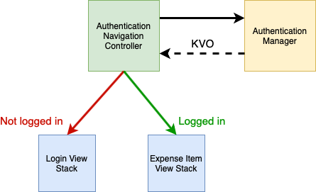
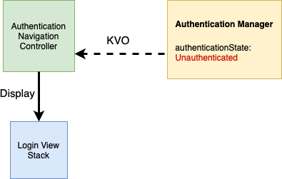
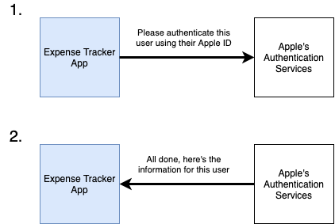

# 🏗 App Architecture

Expense Tracker is a relatively simple application, currently sporting three unique screens. Although simple, I utilized MVC to architect the app such that adding more features in the future should be easy. It consists of an authentication component that manages authenticating the user, and an expense item component which allows the user to create and delete different expense items. Both of these components depend on network connectivity to perform their respective actions, so I utilized protocols and objective inheritance to build a robust network layer that can be unit tested easily.

## Authentication

#### Overview

Expense Tracker uses a simple mechanism to implement authenticated routes by following a structure similar to MVC. The diagram below illustrates how a controller directly communicates with the model, and then uses key-value observing updates to determine whether it should display the authenticated, or non-authenticated view hierarchy to the user.

The authentication navigation controller first calls a method on the authentication manager called `refreshAuthenticationStatus`, which the authentication manager uses as an excuse to use network data and retrieve the current navigation status from the server:

The server will then check the session object it has associated with the current user's request to determine if the user is authenticated or not. It will return a JSON object containing the property `isAuthenticated: Bool`.

In this example, the authentication manager will receive and decode a JSON object that contains `isAuthenticated: False` from the server. The authentication manager will then set an internal `authenticationState` property to reflect the response it received from the server. The authentication navigation controller on the left hand side is essentially eavesdropping and receives an update that the authentication state has updated through the use of the KVO mechanism.

The Authentication navigation controller will use this newly acquired information to then display the correct view hierarchy depending on the new authentication status it was given.

From a high level, this represents the inner workings of the authentication flow in the Expense Tracker application. It follows an architecture that resembles MVC, where network requests and authentication state management is abstracted away from the controller. This allows the navigation controller to focus on one job: Display the correct view hierarchies given the user's current authentication status. This helps keep implementation files small and easy to understand.

#### Sign in with Apple

I wanted to get experience with more frameworks available on iOS, so I decided to implement Sign in with Apple from the Authentication Services framework. When the user presses the button to sign in, I present an `ASAuthorizationController` which is set up to authenticate users using their Apple ID. The `ETAuthenticationManager` that I introduced above implements the `ASAuthorizationControllerDelegate` protocol, so once the user has finished the Sign in with Apple flow, it is responsible for the completion.

Once the user finished authenticating, the presented `ASAuthorizationController` will call the `authorizationController didCompleteWithAuthorization` method of its delegate. The authorization object passed to the delegate contains information that was requested about the newly authenticated user such as email, name, user identifier, and identity token. The identity token is an encrypted JWT (JSON Web Token) provided by Apple which can be used to verify if the user has officially authenticated with their Apple ID using Authentication Services.

Now that we have an identity token from Apple that represents this user, we can send it to our server which can verify its legitimacy before authenticating the user.

If the server determines the identity token is valid, it will mark this user as authenticated for future requests. More information can be found about how the server verifies the token and manages user authentication state in the [Expense Tracker Server Repository](https://github.com/mikemalisz/expense-tracker-server).

## Expense Items
