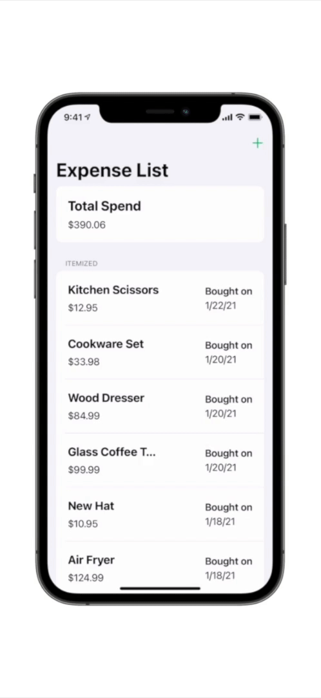

# 🏗 App Architecture

Expense Tracker is a relatively simple application, currently sporting three unique screens. Although simple, I utilized MVC to architect the app such that adding more features in the future should be easy. It consists of an authentication component that manages authenticating the user, and an expense item component which allows the user to create and delete different expense items. Both of these components depend on network connectivity to perform their respective actions, so I utilized protocols and object inheritance to build a robust network layer that can be unit tested easily.

## Table of Contents

1. [Authentication](#authentication)
2. [Expense Items](#expense-items)
3. [Network Layer](#network-layer)

<h2 id="authentication">Authentication</h2>

#### Overview

Expense Tracker uses a simple mechanism to implement authenticated routes by following a structure similar to MVC. The diagram below illustrates how a controller directly communicates with the model, and then uses key-value observing updates to determine whether it should display the authenticated, or non-authenticated view hierarchy to the user.


The authentication navigation controller first calls a method on the authentication manager called `refreshAuthenticationStatus`, which the authentication manager uses as an excuse to use network data and retrieve the current navigation status from the server:


The server will then check the session object it has associated with the current user's request to determine if the user is authenticated or not. It will return a JSON object containing the property `isAuthenticated: Bool`.


In this example, the authentication manager will receive and decode a JSON object that contains `isAuthenticated: False` from the server. The authentication manager will then set an internal `authenticationState` property to reflect the response it received from the server. The authentication navigation controller on the left hand side is essentially eavesdropping and receives an update that the authentication state has updated through the use of the KVO mechanism.


The Authentication navigation controller will use this newly acquired information to then display the correct view hierarchy depending on the new authentication status it was given.

From a high level, this represents the inner workings of the authentication flow in the Expense Tracker application. It follows an architecture that resembles MVC, where network requests and authentication state management is abstracted away from the controller. This allows the navigation controller to focus on one job: Display the correct view hierarchies given the user's current authentication status. This helps keep implementation files small and easy to understand.

#### Sign in with Apple


I wanted to get experience with more frameworks available on iOS, so I decided to implement Sign in with Apple from the Authentication Services framework. When the user presses the button to sign in, I present an `ASAuthorizationController` which is set up to authenticate users using their Apple ID. The `ETAuthenticationManager` that I introduced above implements the `ASAuthorizationControllerDelegate` protocol, so once the user has finished the Sign in with Apple flow, it is responsible for the completion.

Once the user finished authenticating, the presented `ASAuthorizationController` will call the `authorizationController didCompleteWithAuthorization` method of its delegate. The authorization object passed to the delegate contains information that was requested about the newly authenticated user such as email, name, user identifier, and identity token. The identity token is an encrypted JWT (JSON Web Token) provided by Apple which can be used to verify if the user has officially authenticated with their Apple ID using Authentication Services.


Now that we have an identity token from Apple that represents this user, we can send it to our server which can verify its legitimacy before authenticating the user.


If the server determines the identity token is valid, it will mark this user as authenticated for future requests. More information can be found about how the server verifies the token and manages user authentication state in the [Expense Tracker Server Repository](https://github.com/mikemalisz/expense-tracker-server).

<h2 id="expense-items">Expense Items</h2>

Now that user is authenticated, they will have access to their expense items. From here, the user can either create a new itemized expense, or delete existings ones.



#### Data Structure

An expense item is simply a container of a few properties such as the expense title, amount, date purchased, and date created. Here is what a JSON representation of an expense item would look like coming from the server:

```json
{
	"itemId": "0be79211-d813-402a-b2d1-11c78be98695",
	"amountInCents": 329,
	"expenseTitle": "Milk",
	"dateOfPurchase": 1610919480000,
	"dateCreated": 1611351573627
}
```

Coming from Swift, structs are the perfect container for storing simple data like this from the server. Normally, I would adopt `Codable` for my data container structs and would be able to convert them to and from JSON objects easily. I learned quickly that Objective-C's structs are very different. Since Objective-C structures aren't objects, they don't play nicely with other Objective-C data structures like `NSArray` which only accepts objects.

This led me to create an `ETExpenseItem` class which would contain all the information as properties, and would be compatible with other common data structures.

#### Expense Item Manager

The `ETExpenseItemManager` class is the Swiss Army Knife when it comes to working with expense items. It can retrieve the user's expense items from the server and store them locally, create new expense items, and delete existing ones. All interactions with expense items go through this object.

Some of the methods require sending the server some information, such as `submitNewExpenseItemWithTitle` and `deleteExpenseItemWithItemId`. In these cases, the information that's passed into the method is bundled up into an `NSDictionary` object, and then serialized using the `NSJSONSerialization dataWithJSONObject` API. Once this data is serialized, it can be handed off to the `ETItemServer` property which takes care of performing the network request. `ETItemServer` is a protocol, which makes it easy to swap in different implementations when unit testing or using it normally.

Each method that requires a network request (such as refresh/submit/delete expense item) expects to be provided a completion handler block. This block gets executed when the server request has completed and can optionally contain an error if something goes wrong.

The server returns the user's updated list of expense items for each network request related to expense items. For example, if the `submitNewExpenseItemWithTitle` method is called, the server will first insert the new expense item into the database and then query for all of the user's expense items before returning a JSON object of them. This makes it easy to keep the client always up to date with what is stored in the database.

<h2 id="network-layer">Network Layer</h2>

Since this app requires many of its components to interact with a single back-end server, I decided to utilize subclassing and protocols to make the network code easily expandable and testable.

#### Base Server

The `ETBaseServer` class is meant to be an "abstract" class of sorts, or in other words: It should be used only through subclasses. It offers an API for performing data tasks using a supplied request, and then converts the server response into either a `NSDictionary` containing the data from the server, or an error if something went wrong along the way. It then passes the data or error back to the completionHandler block that was supplied in the method.

###### Initialization

`ETBaseServer` and its subclasses expect an object which adopts the `ETNetworkSession` protocol to be provided during initialization. The `ETNetworkSession` protocol is designed to be very similar to the `NSURLSession dataTaskWithRequest` API. This allows Base Server implementations to be decoupled from the `NSURLSession` object, making it very easy to create a `MockNetworkSession` class which can be used for unit testing and intercepting raw network requests. To use the standard `NSURLSession` object in the actual application code, I extended the `NSURLSession` class using categories and adopted the `ETNetworkSession` protocol.

#### Server Providers

These are the concrete subclasses of the `ETBaseServer` class and configure the requests appropriately for each use case, before calling the `performDataTaskWithRequest` method on the base class implementation. Examples include `ETAuthenticationServerProvider` which handles network requests around authentication, and `ETItemServerProvider` which handles expense item network requests. The server providers primarily just configure `NSURLRequest` instances for each task, like setting the path for the request, and setting the HTTP body and method properties of the request.
