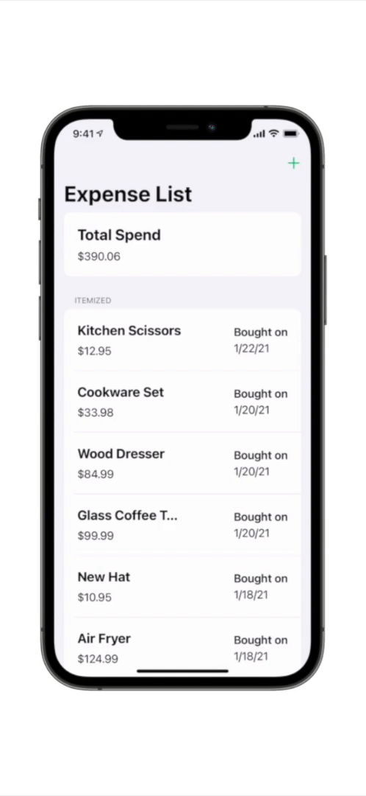
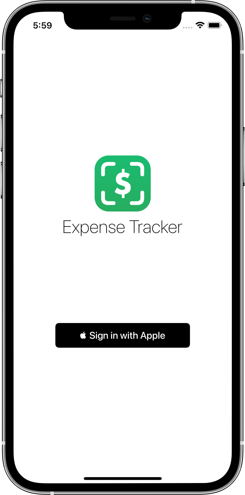

# Expense Tracker iOS

<p align="center">
   
</p>

<p align="center">
   <a href="https://apps.apple.com/us/app/expense-tracker-itemized-list/id1550367538">
   
   </a>
</p>

Expense Tracker is an iOS app that can help you itemize your expenses and keep track of your spending habits. It is written in Objective-C and is supported by a Node.js backend utilizing the Express framework and PostgreSQL for data persistence.

## Project Goals



My biggest goal of this project was to learn Objective-C, while also learning some other frameworks provided by Apple that I haven't used yet. I decided to get exposure to the Authentication Services framework by implementing Sign in with Apple, which I was able to use to implement user authentication on my server. I also got experience creating unit tests in Objective-C as well as working with table views and basic navigation.

## Table of Contents

Here are some deep dives into the technical details of the app:

1. [Architecture](Documentation/Architecture.md)
2. [Unit Testing](Documentation/unit-testing.md)
3. [Build Configuration and Deployment](Documentation/build-and-deployment.md)
4. [Server Backend and Database](https://github.com/mikemalisz/expense-tracker-server)

## Building Locally

1. Setup and run the Node.js server for this application
   The server compliment of this application must be running since the network layer depends on connecting to it for the user's current authentication status, expense feeds, etc.
2. Create a xcconfig file somewhere in the project following this format:

```
APP_MODE=development

# The url of the Node.js server
SERVER_URL=http:/${}/localhost:3000/
```

3. Update each configuration to use this new xcconfig file under `Expense Tracker > Project > Expense Tracker > Configurations`

4. The app should now build and run 🚀
